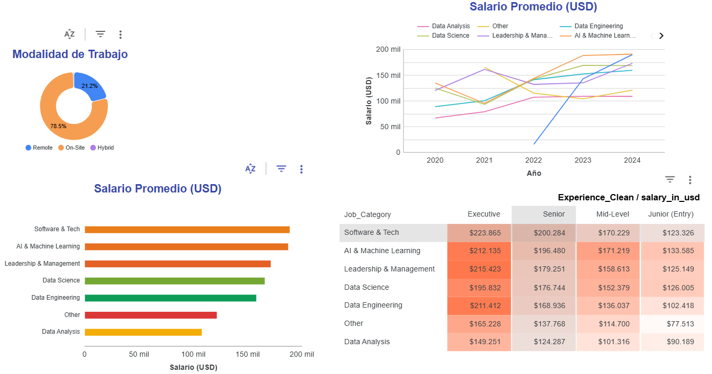

# 🤖 Estado de los Salarios Tech: El Auge de la IA (2020-2024)


---

## 📋 Resumen Ejecutivo

El panorama tecnológico está cambiando aceleradamente. Con la explosión de la Inteligencia Artificial Generativa y la consolidación del trabajo remoto, las organizaciones están redefiniendo sus estrategias de talento y compensación.

Este proyecto analiza **93,090 registros salariales** del sector tecnológico global para responder preguntas de negocio críticas sobre la valoración del talento en la era de los datos.

> **❓ Pregunta de Negocio:** *"¿Es real el 'Hype de la IA' en términos de compensación? ¿Cómo se comparan estos roles frente a la Ingeniería de Software tradicional?"*

---

## 🔍 Hallazgos Clave (Insights)

El análisis revela una competencia feroz en la cima de la pirámide tecnológica. A continuación, el desglose de los puntos más relevantes:

### 1. Ranking Salarial: El Empate Técnico
Contrario a la creencia popular, la IA no ha desplazado totalmente a la Ingeniería de Software. Ambos dominios lideran el mercado.

| Dominio / Categoría | Salario Promedio (USD) | Posición |
| :--- | :---: | :---: |
| **Software & Tech** | **$189,028** | 🥇 1º |
| **AI & Machine Learning** | **$187,575** | 🥈 2º |
| *Promedio Global del Sector* | *$157,940* | - |

### 2. Otros Descubrimientos
*   **🏢 Sorpresa Presencial:** Los datos sugieren un posible retorno a la oficina o un sesgo en los roles de alta ingeniería: solo el **21.2%** de los roles analizados operan en modalidad 100% remota.
*   **🏗️ El Auge de Data Engineering:** Se observa una tendencia alcista notable en los roles de Ingeniería de Datos, validando la inversión masiva en infraestructura para soportar la IA.
*   **🚀 Techos Salariales:** Los roles Ejecutivos rompen la barrera de los **$210k USD**, demostrando el alto retorno de la especialización técnica avanzada + habilidades de gestión.

---

## 📊 Dashboard Interactivo

Hemos diseñado un panel de control centrado en la **Autonomía Analítica**, permitiendo al usuario filtrar por años, experiencia y ubicación geográfica.

[](https://lookerstudio.google.com/reporting/af99fbc4-5fec-4065-b5e4-16cdaf807dce)



> *Haz clic en el botón superior para interactuar con los datos en tiempo real.*

---

## 🛠️ Metodología

El enfoque del proyecto fue transformar datos crudos y complejos en categorías de negocio intuitivas para la toma de decisiones estratégicas.

### Stack Tecnológico
*   **Python (Pandas):** Limpieza, categorización y feature engineering.
*   **Looker Studio:** Visualización y storytelling de datos.
*   **Git/GitHub:** Control de versiones y documentación.

### Proceso ETL
1.  **Ingesta:** Dataset público de Salarios en Ciencia de Datos (2020-2024).
2.  **Taxonomía de Roles:** Se condensaron más de 300 cargos técnicos (*Job Titles*) en **6 dominios estratégicos** (AI/ML, Data Science, Data Engineering, Leadership, Software, Analysis) para permitir comparaciones efectivas ("Peras con Peras").
3.  **Normalización:** Estandarización de niveles de experiencia (*Entry* a *Executive*) y limpieza de fechas para análisis de series temporales.

---

## 📂 Estructura del Repositorio

```text
├── 📁 data/                # Archivos CSV procesados y listos para consumo
│   └── AI_Salaries_Cleaned.csv
├── 📁 notebooks/           # Scripts de Python para ETL y Análisis
│   └── etl_salaries.ipynb
├── 📁 images/              # Recursos visuales
│   └── dashboard_preview.png
└── README.md               # Documentación del proyecto

----------------------------------------------------------------

Proyecto desarrollado por Alejandro Barrenechea como parte de un desafío técnico de Data Analytics.